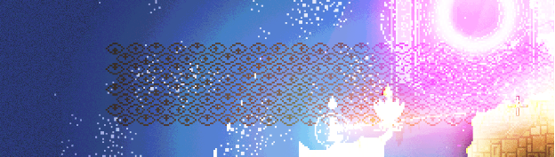
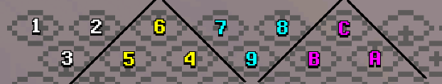

# Welcome


This is a project with the goal of solving the [Eyes Messages Mystery](https://noita.wiki.gg/wiki/Eye_Messages) from the [Noita](https://store.steampowered.com/app/881100/Noita/) game.

## About the approach
While reading about the cypher in the [Noita's Discord channel](https://discord.com/invite/SZtrP2r) I had an idea of trying to interpretate the eye glyphs as braille characteres, and decided to create an algorithm for it.

### How the translation works
Given the [raw data provided by the wiki](https://docs.google.com/document/d/1s6gxrc1iLJ78iFfqC2d4qpB9_r_c5U5KwoHVYFFrjy0/edit#heading=h.qwaul8youupp) of the messages I needed a way to convert values of base 5 (all the directions) to base 2 (zeroes and ones).

```json
{
    "east-1": [
        "201013223304041130232114313033004024000",
        "032041220001422242122220110003201341113",
        "310221044000200104040144142033022034241",
        "231313130031132120142231331441341441211",
        "014003212114130041110100241241004031001",
        "040331432341122101010040120412442442402",
        "13331220330103113111211210322314",
        "1310424224130304110203123204313"
    ],
}
```

```json
{
    "east-1": [
        [0,1,0,1,0,0,0,0,0,0,1,0,1,0,0,0,0,1,0,0,0,0,0,0,0,0,0,1,0,0,1,1,0,1,0,0,1,1,1],
        [1,0,0,1,0,0,0,0,1,1,1,0,0,0,0,0,0,0,0,0,0,0,0,1,0,0,1,1,1,0,0,1,0,0,0,0,0,0,0],
        [0,0,1,0,0,0,1,0,0,1,1,1,0,1,1,0,1,0,1,0,1,0,0,0,0,0,0,1,0,0,1,0,0,1,0,0,0,0,0],
        [0,0,0,0,0,0,0,0,1,1,0,0,0,0,0,0,0,1,0,0,0,0,0,0,0,0,0,0,0,0,0,0,0,0,0,0,0,0,0],
        [1,0,0,1,1,0,0,0,0,0,0,0,0,0,1,1,0,0,0,0,1,0,1,1,0,0,0,0,0,0,1,1,0,1,0,0,1,1,0],
        [1,0,1,0,0,0,0,0,0,0,0,0,0,0,0,0,1,0,1,0,1,1,0,1,0,0,1,0,0,0,0,0,0,0,0,0,0,1,0],
        [0,0,0,0,0,0,0,1,0,0,1,0,1,0,0,0,0,0,0,0,0,0,0,0,0,1,0,0,0,0,0,0],
        [0,0,0,1,0,0,0,0,0,0,0,0,1,0,1,0,0,0,1,0,1,0,0,0,0,0,1,0,0,0,0]
    ]
}
```

Then, I would need to group the data into [trigrams](https://docs.google.com/document/d/1s6gxrc1iLJ78iFfqC2d4qpB9_r_c5U5KwoHVYFFrjy0/edit#heading=h.ebz8udh1ijc2) (groups of three).



```json
{
    "east-1": [
        [0,1,1], [0,0,0], [1,0,1], [0,0,0], [0,0,0], [1,0,0], [0,1,1], [0,1,0], [1,0,0], [0,0,0],
        [0,0,0], [0,0,1], [0,0,0], [0,0,0], [0,0,0], [1,0,0], [0,0,0], [1,0,0], [1,0,1], [0,1,0],
        [1,1,0], [0,1,0], [1,0,0], [0,0,0], [1,1,0], [0,0,1], [0,0,0], [0,0,1], [0,0,0], [0,0,0],
        [1,0,0], [1,0,0], [1,1,1], [0,0,1], [0,1,0], [0,0,1], [0,1,0], [1,0,0], [1,0,0], [0,0,1],
        [0,0,0], [0,0,0], [0,0,0], [0,0,0], [1,0,0], [0,0,0], [1,0,0], [0,0,0], [1,0,0], [0,0,0],
        [0,0,0], [0,0,0], [1,0,1], [1,0,0], [1,1,0], [0,0,0], [0,0,0], [0,0,0], [0,0,0], [0,0,0],
        [0,0,0], [0,0,1], [1,0,0], [0,1,0], [0,0,1], [1,0,1], [0,1,1], [1,0,1], [0,0,0], [1,0,0],
        [0,0,0], [0,0,0], [1,1,0], [0,0,0], [1,0,0], [0,0,0], [1,1,0], [0,1,0], [0,0,0], [0,0,0],
        [0,0,1], [0,0,0], [0,1,0], [0,0,0], [0,1,0], [0,0,0], [1,0,1], [1,0,0], [0,0,0], [0,0,0],
        [0,0,1], [1,0,0], [0,0,0], [0,0,0], [0,1,0], [1,0,0], [0,0,0], [0,0,0], [0,0,0]
    ]
}
```

Since the community has driven towards the approach of grouping the trigrams into pairs, that should be the next step. Now, for each in-game message, we have a list of paired trigrams.

```json
{
    "east-1": [
        [[0,1,1],[0,0,0]], [[1,0,1],[0,0,0]], [[0,0,0],[1,0,0]],
        [[0,1,1],[0,1,0]], [[1,0,0],[0,0,0]], [[0,0,0],[0,0,1]],
        [[0,0,0],[0,0,0]], [[0,0,0],[1,0,0]], [[0,0,0],[1,0,0]],
        [[1,0,1],[0,1,0]], [[1,1,0],[0,1,0]], [[1,0,0],[0,0,0]],
        [[1,1,0],[0,0,1]], [[0,0,0],[0,0,1]], [[0,0,0],[0,0,0]],
        [[1,0,0],[1,0,0]], [[1,1,1],[0,0,1]], [[0,1,0],[0,0,1]],
        [[0,1,0],[1,0,0]], [[1,0,0],[0,0,1]], [[0,0,0],[0,0,0]],
        [[0,0,0],[0,0,0]], [[1,0,0],[0,0,0]], [[1,0,0],[0,0,0]],
        [[1,0,0],[0,0,0]], [[0,0,0],[0,0,0]], [[1,0,1],[1,0,0]],
        [[1,1,0],[0,0,0]], [[0,0,0],[0,0,0]], [[0,0,0],[0,0,0]],
        [[0,0,0],[0,0,1]], [[1,0,0],[0,1,0]], [[0,0,1],[1,0,1]],
        [[0,1,1],[1,0,1]], [[0,0,0],[1,0,0]], [[0,0,0],[0,0,0]],
        [[1,1,0],[0,0,0]], [[1,0,0],[0,0,0]], [[1,1,0],[0,1,0]],
        [[0,0,0],[0,0,0]], [[0,0,1],[0,0,0]], [[0,1,0],[0,0,0]],
        [[0,1,0],[0,0,0]], [[1,0,1],[1,0,0]], [[0,0,0],[0,0,0]],
        [[0,0,1],[1,0,0]], [[0,0,0],[0,0,0]], [[0,1,0],[1,0,0]],
        [[0,0,0],[0,0,0]], [[0,0,0]]
    ]
}
```

Then the next step is to convert each paired trigram into [Braille Dots](https://www.pharmabraille.com/pharmaceutical-braille/the-braille-alphabet/) and, after that, converting the braille dots into braille characters.

```json
{
    "east-1": [
        [2,3], [1,3], [4], [2,3,5], [1], [6], [], [4], [4],
        [1,3,5], [1,2,5], [1], [1,2,6], [6], [], [1,4], [1,2,3,6], [2,6],
        [2,4], [1,6], [], [], [1], [1], [1], [], [1,3,4], [1,2],
        [], [], [6], [1,5], [3,4,6], [2,3,4,6], [4], [], [1,2], [1],
        [1,2,5], [], [3], [2], [2], [1,3,4], [], [3,4], [], [2,4],
        [], []
    ]  
}
```

After this we are also able to translate the braille characters into text.

```json
{
    "east-1": {
        "braille-characters" : "⠆⠅⠈⠖⠁⠠⠀⠈⠈⠕⠓⠁⠣⠠⠀⠉⠧⠢⠊⠡⠀⠀⠁⠁⠁⠀⠍⠃⠀⠀⠠⠑⠬⠮⠈⠀⠃⠁⠓⠀⠄⠂⠂⠍⠀⠌⠀⠊⠀⠀",
        "text" : "2K@6A, @@OHA<, CV5I*  AAA MB  ,E+!@ BAH '11M / I  "
    } 
}
```


## How to execute the program
On your terminal, run the following command:

```
node index.js
```

This will execute the translation of all messages and output a .json file with the generated data.